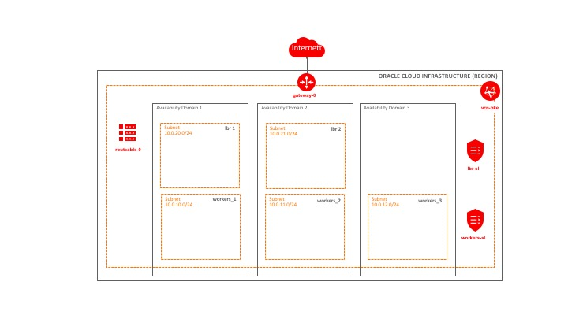

[terraform]: https://terraform.io
[oci]: https://cloud.oracle.com/cloud-infrastructure
[oci provider]: https://github.com/oracle/terraform-provider-oci/releases
[API signing]: https://docs.us-phoenix-1.oraclecloud.com/Content/API/Concepts/apisigningkey.htm
[Kubectl]: https://kubernetes.io/docs/tasks/tools/install-kubectl/

[oke]: https://docs.cloud.oracle.com/iaas/Content/ContEng/Concepts/contengoverview.htm
[oke_vcn]: https://docs.cloud.oracle.com/iaas/Content/ContEng/Concepts/contengnetworkconfig.htm
[oke_vcn_sample]: https://docs.cloud.oracle.com/iaas/Content/ContEng/Concepts/contengnetworkconfigexample.htm


# Terraform Installer for Network configuration required by Oracle Container Engine for Kubernetes (OKE)
## About

Oracle Cloud Infrastructure Container Engine for Kubernetes is a fully-managed, scalable, and highly available service that you can use to deploy your containerized applications to the cloud. Use Container Engine for Kubernetes (sometimes abbreviated to just [OKE][oke]).  

This terraform installer takes care of the network configuration required by OKE to host your Kubernetes worker nodes and Loadbalancers. This network configuration is in accordance with the sample network configuration provided by the OKE documentation. 


The Kubernetes Installer for Oracle Cloud Infrastructure provides a Terraform-based Kubernetes installation for Oracle 
Cloud Infrastructure. It consists of a set of [Terraform][terraform] modules and an example base configuration that is 
used to provision and configure the resources needed to run a highly available and configurable Kubernetes cluster on [Oracle Cloud Infrastructure][oci] (OCI).


## Network Overview

Terraform is used to _provision_ the virtual cloud network and all required resources for OKE. According to the documentation the [OKE network][oke_vcn] has the following requirements:

- The VCN must have a CIDR block defined that is large enough for at least five subnets, in order to support the number of hosts and load balancers a cluster will have. A /16 CIDR block would be large enough for almost all use cases (10.0.0.0/16 for example). The CIDR block you specify for the VCN must not overlap with the CIDR block you specify for pods and for the Kubernetes services.
- The VCN must have an internet gateway defined.
- The VCN must have a route table defined that has a route rule specifying the internet gateway as the target for the destination CIDR block.
- The VCN must have five subnets defined. 
- The VCN must have security lists defined for the worker node subnets and the load balancer subnets. 

The OKE documentation also refers to a [network config with sample values][oke_vcn_sample], and this provider are using the values from this example, but you can change it using your own names and values.




## Prerequisites

1. Download and install [Terraform][terraform] (v0.10.3 or later)
2. Download and install the [OCI Terraform Provider][oci provider] (v2.0.0 or later)
3. Create an Terraform configuration file at  `~/.terraformrc` that specifies the path to the OCI provider:
```
providers {
  oci = "<path_to_provider_binary>/terraform-provider-oci"
}
```
4.  Ensure you have [Kubectl][Kubectl] installed if you plan to interact with the cluster locally


## Quick start

### Customize the configuration

Override any default values 

Open the terraform.tfvars file and set the mandatory input variables.  You can also set the optional values by commenting out the variable and provide your own values. 


#### Mandatory Input Variables:

##### OCI Provider Configuration

name                                | default                 | description
------------------------------------|-------------------------|-----------------
tenancy_ocid                        | None (required)         | Tenancy's OCI OCID
compartment_ocid                    | None (required)         | Compartment's OCI OCID
user_ocid                           | None (required)         | Users's OCI OCID
fingerprint                         | None (required)         | Fingerprint of the OCI user's public key
private_key_path                    | None (required)         | Private key file path of the OCI user's private key
region                              | None (required)         | String value of region to create resources

#### Optional Input Variables:

##### VCN parameters 
name                                | default                 | description
------------------------------------|-------------------------|------------
vcn_name                            | vcn_oke                 | Name of the VCN network
vcn_dns_label                       | vcnoke                  | Dns name of the VCN network
cidr_vcn                            | 10.0.0.0/16             | CIDR of the VCN network

##### Worker subnets 
name                                | default                 | description
------------------------------------|-------------------------|------------
subnet_workers_ad1_name             | workers_1               | Name of the workers subnet in ad1
subnet_workers_ad2_name             | workers_2               | Name of the workers subnet in ad2
subnet_workers_ad3_name             | workers_3               | Name of the workers subnet in ad3
subnet_workers_ad1_dnslabel         | workers1                | Dns name of the workers subnet in ad1
subnet_workers_ad2_dnslabel         | workers2                | Dns name of the workers subnet in ad2
subnet_workers_ad3_dnslabel         | workers3                | Dns name of the workers subnet in ad3
cidr_subnet_workers_ad1             | 10.0.10.0/24            | CIDR for workers subnet in ad1
cidr_subnet_workers_ad2             | 10.0.11.0/24            | CIDR for workers subnet in ad2
cidr_subnet_workers_ad3             | 10.0.12.0/24            | CIDR for workers subnet in ad3

##### Loadbalancer subnets 
name                                | default                 | description
------------------------------------|-------------------------|------------
subnet_lbrs_ad1_name                | lbrs_1                  | Name of the lbr subnet in ad1
subnet_lbrs_ad2_name                | lbrs_2                  | Name of the lbr subnet in ad2
subnet_lbrs_ad1_dnslabel            | lbrs1                   | Dns name of the lbr subnet in ad1
subnet_lbrs_ad2_dnslabel            | lbrs2                   | Dns name of the lbr subnet in ad2
cidr_subnet_lbrs_ad1                | 10.0.20.0/24            | CIDR for lbr subnet in ad1
cidr_subnet_lbrs_ad2                | 10.0.21.0/24            | CIDR for lbr subnet in ad2

##### Internet Gateway                                          
name                                | default                 | CIDR for workers subnet in ad3description
------------------------------------|-------------------------|------------
ig_name                             | gateway-0               | Name of the Internet gateway

##### Routetable
name                                | default                 | description
------------------------------------|-------------------------|------------
rt_display_name                     | routeable-0             | Name of the routetable

##### Security Lists
name                                | default                 | description
------------------------------------|-------------------------|------------
sl_worker_name                      |                         | Name of the worker security list
sl_lbr_name                         |                         | Name of the lbr security list


### Deploy the network

Initialize Terraform:

```
$ terraform init
``` 

View what Terraform plans do before actually doing it:

```
$ terraform plan
```

Use Terraform to Provision k8s network resources on OCI:

```
$ terraform apply
```


